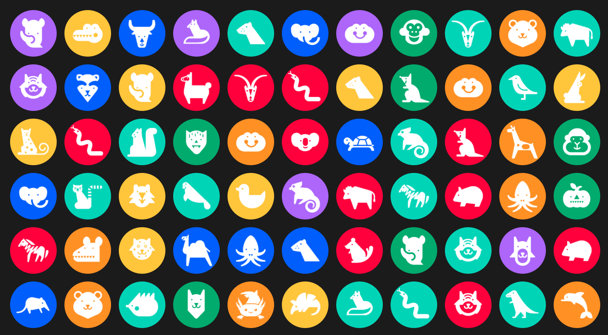

# Anonymous Animals API

Avatar placeholder service for web developers and designers. This API provides access to anonymous animal avatars given an animal name or a username. **You will always get the same avatar given that you provide the same username!**



## How do I use it?
The anonymous animals API provides two different services, get an animal avatar providing the animal's name or get a animal avatar providing a username.

## Fetching Animal Avatar With Username
Remember that the API will always return the same avatar given the same username!
* Endpoint: `http://anonymous-animals.herokuapp.com/avatar/:username`

## Fetching Animal Avatar With Animal Name
Refer to the list of animals to know that are all the possible values for the `animalname` variable.
* Endpoint: `http://anonymous-animals.herokuapp.com/animal/:animalname`

## Example Usage
```html
</img>
```
## List of Animals
* Alligator
* Chipmunk
* Gopher
* Liger
* Quagga
* Anteater
* Chupacabra
* Grizzly
* Llama
* Rabbit
* Armadillo
* Cormorant
* Hedgehog
* Manatee
* Raccoon
* Auroch
* Coyote
* Hippo
* Mink
* Rhino
* Axolotl
* Crow
* Hyena
* Monkey
* Sheep
* Badger
* Dingo
* Ibex
* Moose
* Shrew
* Bat
* Dinosaur
* Ifrit
* Narwhal
* Skunk
* Beaver
* Dolphin
* Iguana
* Orangutan
* Squirrel
* Buffalo
* Duck
* Jackal
* Otter
* Tiger
* Camel
* Elephant
* Kangaroo
* Panda
* Turtle
* Capybara
* Ferret
* Koala
* Penguin
* Walrus
* Chameleon
* Fox
* Kraken
* Platypus
* Wolf
* Cheetah
* Frog
* Lemur
* Pumpkin
* Wolverine
* Chinchilla
* Giraffe
* Leopard
* Python
* Wombat